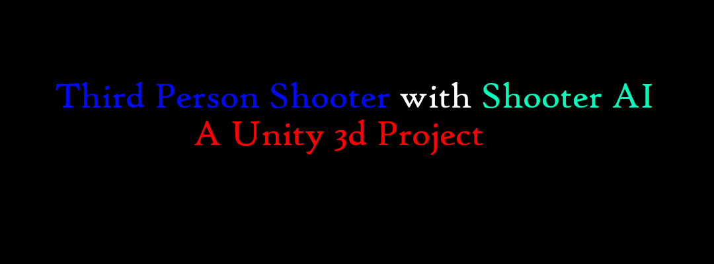
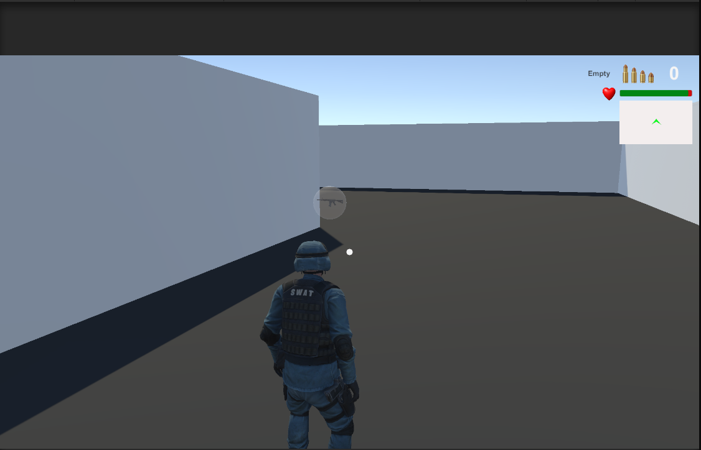
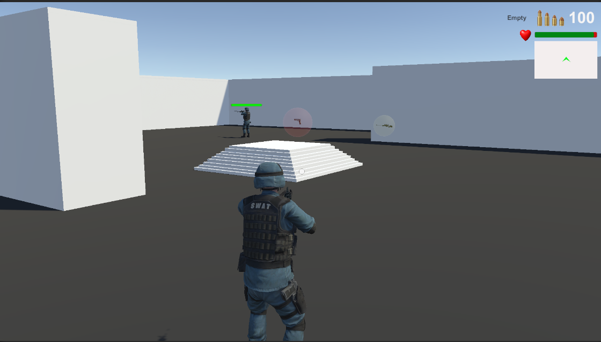
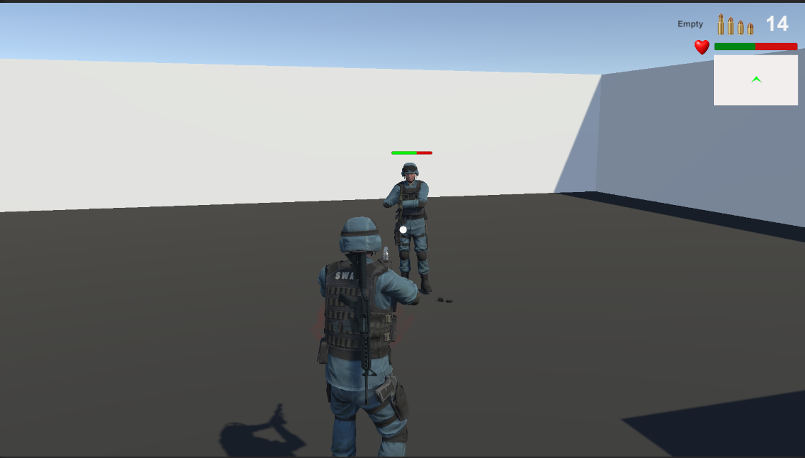
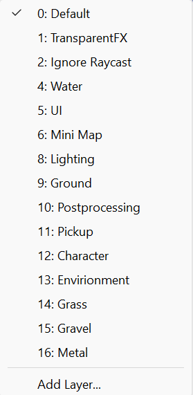
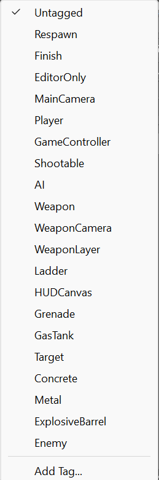

# Third Person Shooter Player With Shooter AI(NPC)
## Description : A Third Person Shooting Player with three weapon and a NPC shooter.This unity packages have some dependency. You need to download and imported inside of this unity project's Asset folder.Where only one have external asset a mixamo character and animations.You are requested to download and put all the dependency in your project otherwise it may not work properly.

## Contents :
- [x] Third Person Shooter Player(Locomotion with Jump,shoot,reload,weapon change)
- [x] First Person Shooter Player
- [x] Cross Platform Control
- [ ] Multiple AI
- [ ] AI take cover and Hide ability!
- [x] Mini Map
- [x] Shooter Navmesh AI with different state(Patrol,Find Weapon,Find Target,Death,Attack,ChaseTarget)
- [x] Three Raycast Weapon(Pistol,Rifle,Sniper)
- [x] Four Demo Scene
- [x] Weapon Pickup for player and AI
- [x] Demo Scene

See Using project [Doc] Video in YouTube.
## Screenshots





## Dependent Packages :
---
* Unity Asset Store Packages
1. [Standard Asset Character](https://github.com/Unity-Technologies/Standard-Assets-Characters)
2. [AWP SNIPER](https://assetstore.unity.com/packages/3d/props/guns/awp-sniper-96523)
3. [Unity Particle Pack](https://assetstore.unity.com/packages/essentials/tutorial-projects/unity-particle-pack-127325#reviews)
4. [M9 Knife](https://assetstore.unity.com/packages/3d/props/weapons/m9-knife-7597#description)
5. [[PBR] Pistol](https://assetstore.unity.com/packages/3d/props/guns/pbr-pistol-33838)
6. [Rifle](https://assetstore.unity.com/packages/3d/props/guns/rifle-25668)
7. [FPS Grenade](https://assetstore.unity.Recordercom/packages/3d/fps-grenade-model-textures-63667#description)

---
* Unity Registry Store Assets
1. [Cinemachine](https://docs.unity3d.com/Packages/com.unity.cinemachine@2.3/manual/index.html)
2. [Animation Rigging](https://docs.unity3d.com/Packages/com.unity.animation.rigging@1.0/manual/index.html)

---
* External packages
* SWAT Character
1. [Mixamo](https://www/mixamo.com) 

---
* Sounds and Effects
1. [Pixabay](https://pixabay.com/sound-effects/)

---
* YT Video Tutorials
1. [Kiwi Coder](https://www.youtube.com/c/TheKiwiCoder)
2. [Brackeys](https://www.youtube.com/results?search_query=brackeys)

---
## Info
1. Project Name - Third Person Shooter Player
2. Used Unity Version to build this project - 2020.15f2
3. Developer Name : Algo Sanket
4. Social Site : @sankets57590607
5. Contact for Support : srivastavasanket95@gmail.com
6. Build Date : 07-07-2023

## Doc

Need to create Layers :



Need to create Tags : 



Need to assign "Character" Layer to the layers of Player(swat@T-Pose) and _AI_SWAT prefabs.
Need to assign "Pickup" Layer to the all Pickups prefabs.
Need to assign "Minimap" Layer to the minimap prefab.
Need to assign "UI" Layer to the all UI elements.
Need to assign "Everything" Layer to the AudioControl script which attached to the player prefab child object.


```diff
+ Now if you want NPC will attack only to the Player not to each other
```

```diff
- then you need to create **Player** layer and select  to the *swat@T-Pose* which is a child object of **_TPS_Player** Prefab.
- After that change layer of AiVisonSensor which is attached to the _AI_SWAT Prefab with **Player** and **Pickup**.
- Then change 35th line of **AiSensoryMemory.cs** script with 
 ```
 ```diff 
 ! int targets = sensor.Filter(characters, "Player"); 
 ```

